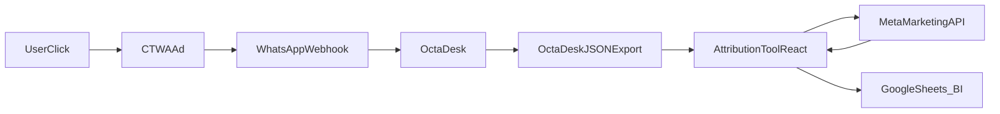

# Contexto CTWA – EMR (Eu Médico Residente)

## Problema de negócio

- A EMR migrou de campanhas de **formulário** para campanhas **Click to WhatsApp (CTWA)**.
- O atendimento inicial acontece via **chatbot no WhatsApp**, rodando no **OctaDesk**, que faz perguntas de pré-qualificação.
- Após a pré-qualificação, o lead entra na etapa de **SQL (Sales Qualified Lead)**, gerenciada pela operação de vendas.
- Com a mudança para CTWA, a operação passou a **não enxergar o funil por campanha** (Campanha → SQL → Venda), pois:
  - O OctaDesk não traz, de forma direta, o **nome da campanha** da Meta.
  - Os times só viam os SQLs e Vendas, mas não conseguiam relacionar claramente com a campanha, ad set e anúncio de origem.

Este projeto existe para **reconstruir a camada de atribuição**, conectando dados do WhatsApp/OctaDesk com a Marketing API da Meta.

## APIs envolvidas

### 1. OctaDesk API

- Documentação de autenticação: [OctaDesk – Authentication](https://developers.octadesk.com/reference/authentication)
- Conceito:
  - Obter um **token de acesso** autenticando a aplicação.
  - Usar esse token para chamar endpoints de **tickets/chats** (ex.: `/tickets`, `/chat/{id}/messages`, etc.).
  - Esses endpoints retornam objetos que, no contexto CTWA, incluem:
    - `customFields` com o campo de integração, por exemplo `id: "octabsp"`.
    - Dentro do integrador, algo como `integrator.customFields.messages[0].referral`, contendo dados vindos do webhook de CTWA do WhatsApp.
- É a partir desses dados que conseguimos resgatar:
  - Informações do **contato** (nome, telefone).
  - Informações de **conversação** (ID, data de criação).
  - Informações de **origem de mídia** (ad ID, CTWA click ID, headline, URL do criativo).

### 2. WhatsApp Business Platform – CTWA (payload de webhook)

- Documentação com exemplo de payload de resposta de CTWA:  
  [CTWA – Welcome Message Sequences](https://developers.facebook.com/documentation/business-messaging/whatsapp/ctwa/welcome-message-sequences)
- No exemplo de webhook, a estrutura relevante é:

```json
"referral": {
  "source_url": "AD_OR_POST_FB_URL",
  "source_id": "ADID",
  "source_type": "ad or post",
  "headline": "AD_TITLE",
  "body": "AD_DESCRIPTION",
  "media_type": "image or video",
  "image_url": "RAW_IMAGE_URL",
  "video_url": "RAW_VIDEO_URL",
  "thumbnail_url": "RAW_THUMBNAIL_URL",
  "ctwa_clid": "CTWA_CLID",
  "ref": "REF_ID"
}
```

- Esses campos, recebidos originalmente pelo parceiro (no caso, o OctaDesk), são persistidos em algum ponto do modelo de dados de tickets/SQLs e ficam disponíveis na resposta da API do OctaDesk.
- O campo mais importante para atribuição de mídia é o **`source_id`**, que corresponde ao **ID do anúncio (AD_ID)** na Meta, e o **`ctwa_clid`**, que identifica o clique CTWA.

### 3. Meta Marketing API – Ad / Adgroup

- Documentação de referência do objeto Ad:  
  [Graph API – Ad](https://developers.facebook.com/docs/marketing-api/reference/adgroup/)
- A partir de um `AD_ID` (que, no nosso contexto, é o `referral.source_id`), é possível obter:
  - Nome do **anúncio** (`ad.name`).
  - Nome e ID da **campanha** (`campaign.id`, `campaign.name`).
  - Nome e ID do **ad set** (`adset.id`, `adset.name`).
- Exemplo de request usando o Ad ID:

```bash
curl -G \
  -d "fields=name,campaign{id,name},adset{id,name}" \
  -d "access_token=<ACCESS_TOKEN>" \
  "https://graph.facebook.com/v25.0/<AD_ID>"
```

- É exatamente esse tipo de chamada que o MVP atual (em `ctwa-attribution-tool.jsx`) faz, gerando comandos `curl` ou um script Python para recuperar essas informações e enriquecer os dados vindos do OctaDesk.

## Fluxo de dados ponta a ponta

1. **Clique no anúncio CTWA**
   - Um usuário vê um anúncio CTWA de EMR no Facebook/Instagram.
   - Ao clicar, é iniciado um fluxo de mensagem no WhatsApp Business.

2. **Webhook do WhatsApp → parceiro (OctaDesk)**
   - O WhatsApp Business Platform envia um **webhook** com o evento de mensagem inicial.
   - Dentro do payload, o campo `messages[].referral` contém:
     - `source_url`, `source_id`, `source_type`
     - `headline`, `body`, `image_url`, `ctwa_clid`, etc.

3. **Persistência no OctaDesk**
   - O OctaDesk recebe esse webhook e:
     - Cria/atualiza um **ticket/chat**.
     - Guarda dados de CTWA em campos personalizados/estrutura de integração (por exemplo, `customFields` com `id: "octabsp"`).
   - Na API do OctaDesk, esses dados ficam expostos no objeto de ticket/chat, em algo como:
     - `customFields`
     - `integrator.customFields.messages[0].referral`

4. **Criação de SQL (Sales Qualified Lead)**
   - Após o fluxo do chatbot, se o lead for qualificado, é marcado como **SQL** e segue no funil de vendas.
   - O SQL é a unidade que interessará para análise de conversão (por campanha, criativo, etc.).

5. **Exportação de dados do OctaDesk**
   - Para análise, EMR pode:
     - Exportar via **API** (por exemplo, buscando tickets/SQLs com filtros de data/status).
     - Ou exportar/configurar um JSON com o payload completo retornado pelo OctaDesk.
   - Esse JSON é a entrada da nossa ferramenta de atribuição.

6. **Ferramenta de atribuição (MVP em React)**
   - O componente `ctwa-attribution-tool.jsx`:
     - Importa o JSON (upload de arquivo ou colando o conteúdo).
     - Faz o parse do JSON e:
       - Aceita tanto **um único objeto** quanto **um array** de objetos.
       - Localiza `customFields` e o campo de integração com dados CTWA.
       - Extrai, para cada item:
         - Dados de contato (`contact.name`, telefone).
         - Metadados de conversa/SQL (`id`, `createdAt`).
         - Dados de CTWA (`source_id`, `ctwa_clid`, `headline`, `body`, `image_url`, `source_url`).
     - Gera uma lista de registros com, no mínimo, `sourceId` válido.
   - A ferramenta mostra uma visão prévia dos registros encontrados e permite:
     - Gerar/exportar parcial (sem enriquecimento).
     - Ou avançar para consulta da API da Meta.

7. **Consulta à Meta Marketing API**
   - A ferramenta identifica todos os `sourceId` únicos (AD_IDs).
   - Gera, para esses IDs:
     - Comandos `curl` prontos para chamar o Graph API.
     - Um script Python equivalente (opcional) que faz as mesmas chamadas em loop.
   - O usuário:
     - Copia os comandos/script.
     - Executa no terminal/ambiente desejado, passando um **access token** válido.
     - Copia o **JSON de resposta** da Meta e cola de volta na ferramenta.

8. **Enriquecimento e consolidação**
   - A ferramenta processa o JSON retornado pela Meta:
     - Aceita tanto **arrays** quanto **vários objetos** colados de uma vez.
     - Constrói um mapa `AD_ID → { adName, campaignId, campaignName, adsetId, adsetName }`.
   - Em seguida, faz o *join*:
     - Para cada registro extraído do OctaDesk (`sourceId`), adiciona os campos de campanha/ad set/ad retornados pela Meta.
   - O resultado final é uma tabela onde cada linha representa:
     - Um lead/SQL oriundo de CTWA, com:
       - Dados do contato.
       - Dados do criativo (headline, imagem, URL).
       - Dados da campanha, ad set e anúncio na Meta.

9. **Exportação para análise (planilhas/BI)**
   - A ferramenta exporta um arquivo **TSV** (tab-separated values), com colunas como:
     - Imagem URL, Contato, Telefone, Data, Campanha, Ad Set, Anúncio, Source ID, CTWA Click ID, Headline.
   - Esse arquivo pode ser:
     - Aberto diretamente no **Google Sheets** ou Excel.
     - Importado em uma ferramenta de BI para construção de dashboards de funil:
       - Campanha → SQLs → Vendas.

## Mapeamento de campos

### Do payload WhatsApp/OctaDesk para o modelo interno

- **Origem (webhook WhatsApp + OctaDesk)**:
  - `messages[].referral.source_id` → ID do anúncio (AD_ID).
  - `messages[].referral.ctwa_clid` → identificador do clique CTWA.
  - `messages[].referral.source_url` → URL do anúncio/post.
  - `messages[].referral.headline` → título do anúncio.
  - `messages[].referral.body` → descrição do anúncio.
  - `messages[].referral.image_url` → URL da imagem do criativo.
  - `contact.name` → nome do contato.
  - `integrator.from.number` (ou similar) → telefone do contato.
  - `createdAt` (ou campo de data do ticket/SQL) → data/hora do evento.

- **Modelo usado na ferramenta (exemplo do MVP)**:
  - `sourceId` → `referral.source_id`
  - `ctwaClid` → `referral.ctwa_clid`
  - `sourceUrl` → `referral.source_url`
  - `headline` → `referral.headline`
  - `adBody` → `referral.body`
  - `imageUrl` → `referral.image_url`
  - `contactName` → `contact.name`
  - `contactPhone` → `integrator.from.number`
  - `createdAt` → `createdAt` do ticket/SQL

### Do resultado da Meta Marketing API para o modelo interno

- **Resposta da Meta (para cada AD_ID)**:
  - `id` → ID do anúncio (deve bater com `sourceId`).
  - `name` → nome do anúncio.
  - `campaign.id` → ID da campanha.
  - `campaign.name` → nome da campanha.
  - `adset.id` → ID do ad set.
  - `adset.name` → nome do ad set.

- **Campos enriquecidos na ferramenta**:
  - `adName` ← `name`
  - `campaignId` ← `campaign.id`
  - `campaignName` ← `campaign.name`
  - `adsetId` ← `adset.id`
  - `adsetName` ← `adset.name`

## Segurança e boas práticas

- **Tokens de acesso (OctaDesk, Meta)**:
  - Nunca devem ser **versionados** no repositório (ex.: arquivos `.jsx`, `.md`, `.json`, etc.).
  - Devem ser guardados em:
    - Variáveis de ambiente.
    - Secret manager / vault apropriado.
  - Rotacionar periodicamente os tokens e limitar o tempo de validade quando possível.

- **Princípio do menor privilégio**:
  - Na Meta, usar apenas permissões necessárias para:
    - Ler dados de anúncios e campanhas.
    - Não conceder permissões de escrita/gerenciamento além do estritamente necessário.
  - No OctaDesk, limitar a integração a escopos de leitura que atendam ao caso de uso de atribuição.

- **Privacidade de dados de contato**:
  - Evitar expor nomes/telefones completos em canais não controlados (por exemplo, não colar dumps em chats abertos).
  - Anonimizar ou pseudonimizar dados para análises que não exijam identificação direta de pessoas.
  - Garantir conformidade com políticas internas e legislação aplicável (LGPD, etc.).

## Fluxo de dados (diagrama)



## API do backend (webhooks)

O backend (Next.js) expõe webhooks que recebem eventos do funil e persistem no Supabase, com enriquecimento via Meta Marketing API quando aplicável.

**Base URL:** a URL pública do seu backend (ex.: `https://seu-dominio.com` ou em dev `http://localhost:3000`).

**Autenticação:** todas as rotas de webhook exigem um dos seguintes headers (valor = variável de ambiente `WEBHOOK_SECRET`):

- `x-webhook-secret: <token>`
- `Authorization: Bearer <token>`

Se `WEBHOOK_SECRET` não estiver definido no servidor, as chamadas são aceitas sem validação (apenas para desenvolvimento).

---

### POST /api/webhooks/conversation-started

Registra uma nova conversa iniciada por CTWA (lead). O body deve estar no **formato OctaDesk**: o mesmo objeto (ou array com um item) que a API do OctaDesk retorna para um ticket/chat, com dados de CTWA em `customFields` (id `octabsp`) → `referral`.

**Body (exemplo mínimo esperado):**

- Objeto com `id` (conversation_id do ticket), `contact`, `createdAt`, e `customFields` contendo o bloco do integrador WhatsApp com `referral.source_id` (obrigatório para atribuição).

**Resposta 200:**

```json
{ "ok": true, "lead": { "id": "uuid", "conversation_id": "...", "status": "lead" } }
```

**Resposta 400:** body inválido ou sem `source_id` no referral (não é CTWA).  
**Resposta 500:** erro ao salvar ou ao chamar a Meta.

O backend faz parse do payload, busca campanha/ad set/ad na Meta (e grava em cache), e faz upsert na tabela `leads` por `conversation_id`.

---

### POST /api/webhooks/opp

Atualiza o lead para status **SQL** (Sales Qualified Lead). A URL do endpoint mantém o nome `opp` por compatibilidade com integrações existentes.

**Body (JSON):**

```json
{
  "conversation_id": "id-do-ticket-no-OctaDesk",
  "opp_id": "id-da-oportunidade-no-CRM"  // opcional; mantido para compatibilidade
}
```

- `conversation_id` (obrigatório): mesmo `id` do ticket usado em conversation-started.
- `opp_id` (opcional): identificador da oportunidade no sistema de vendas (CRM).

**Resposta 200:**

```json
{ "ok": true, "lead": { "id": "uuid", "conversation_id": "...", "status": "sql", "opp_id": "..." } }
```

**Resposta 404:** nenhum lead encontrado com esse `conversation_id`.

---

### POST /api/webhooks/ganho

Atualiza o lead para status **venda** (venda fechada) e preenche `won_at`. A URL do endpoint mantém o nome `ganho` por compatibilidade.

**Body (JSON) – uma das opções:**

- Por conversa: `{ "conversation_id": "id-do-ticket" }`
- Por telefone: `{ "phone": "5511999999999" }` (atualiza o lead mais recente com esse telefone)

**Resposta 200:**

```json
{ "ok": true, "lead": { "id": "uuid", "conversation_id": "...", "status": "venda", "won_at": "..." } }
```

**Resposta 404:** nenhum lead encontrado para o `conversation_id` ou `phone` informado.

---

### Outros endpoints (leitura e exportação)

- **GET /api/funnel?from=YYYY-MM-DD&to=YYYY-MM-DD**  
  Retorna a agregação do funil por campanha/ad set/anúncio (leads, sql, venda). Parâmetros de data opcionais.

- **GET /api/export?format=tsv|csv&from=YYYY-MM-DD&to=YYYY-MM-DD**  
  Download do arquivo de leads com atribuição (TSV ou CSV).

---

## Estado atual do frontend (para evolução)

Use esta seção como contexto ao evoluir a interface (ex.: com outras ferramentas de IA).

**Stack:** Next.js 15 (App Router), React 19, TypeScript, Tailwind CSS. Porta 3000.

**Estrutura de rotas (páginas):**

| Rota | Arquivo | Função |
|------|---------|--------|
| `/` | `app/page.tsx` | Home: texto de apresentação + links para Dashboard e Configurações. |
| `/dashboard` | `app/dashboard/page.tsx` | Funil por campanha: tabela (campanha, ad set, anúncio, leads, SQL, venda), filtro por data (from/to), botão Filtrar, link Exportar TSV. Consome GET `/api/funnel`. |
| `/configuracoes` | `app/configuracoes/page.tsx` | Configurações: formulário para salvar token da Meta e mapeamento de conversões (CAPI). GET/POST `/api/settings/meta-token` e `/api/settings/meta-conversions`. |

**Layout global:** `app/layout.tsx` (metadata, `globals.css`, body com classes Tailwind). Estilo atual: fundo escuro (`bg-zinc-950`), texto claro.

**APIs consumidas pelo front:**
- `GET /api/funnel?from=&to=` → JSON com `totalLeads`, `funnel` (array de `{ campaignName, adsetName, adName, leads, sql, venda }`).
- `GET /api/export?format=tsv|csv&from=&to=` → download do arquivo.
- `GET /api/settings/meta-token` → `{ configured: boolean }`.
- `POST /api/settings/meta-token` → body `{ token }`.

**Componentes:** ainda não há pasta `components/` com UI reutilizável; as páginas usam markup e Tailwind direto. A convenção do projeto é usar `/components` organizados por caso de uso e `/components/ui` para componentes genéricos.

**Dados do funil:** vêm do Supabase (tabela `leads`); o backend agrega por campanha/ad set/ad e retorna em `/api/funnel`. Não há autenticação no front hoje.

---

## Guia de integração: OctaDesk / Digital Guru

Para o funil aparecer no dashboard e na exportação, o sistema que gerencia tickets e SQLs (OctaDesk, Digital Guru ou outro) precisa **chamar os webhooks** nos momentos certos.

### 1. Conversation started (nova conversa CTWA)

**Quando disparar:** assim que um **novo ticket/chat** for criado no OctaDesk (ou no sistema conectado ao WhatsApp) e o payload tiver dados de **referral** (CTWA) – ou seja, a primeira mensagem veio de um anúncio.

**O que enviar:** um **POST** para:

`<BASE_URL>/api/webhooks/conversation-started`

- **Headers:** `Content-Type: application/json` e um dos seguintes:
  - `x-webhook-secret: <WEBHOOK_SECRET>`
  - `Authorization: Bearer <WEBHOOK_SECRET>`
- **Body:** o **mesmo objeto de ticket** que a API do OctaDesk retorna para esse chat (incluindo `customFields` com o bloco do integrador WhatsApp, onde está o `referral`). Pode ser um único objeto ou um array com um objeto.

**Onde configurar (OctaDesk):** se o OctaDesk permitir webhooks/automações “ao criar ticket” ou “ao receber primeira mensagem”, configure uma ação que faça um HTTP POST com o payload do ticket para essa URL. Se não houver webhook nativo, é possível usar um job que consulte a API do OctaDesk (tickets recentes) e, para cada ticket novo com CTWA, envie o payload para esse endpoint.

**Digital Guru / outros:** mesmo conceito: no momento em que o sistema registra “conversa iniciada por anúncio”, enviar o payload do ticket (no formato que o backend espera, compatível com OctaDesk) para `conversation-started`.

### 2. SQL (lead qualificado)

**Quando disparar:** quando o lead for **qualificado** e virar **SQL** no fluxo de vendas (ex.: após o chatbot ou a triagem marcar como oportunidade).

**O que enviar:** um **POST** para:

`<BASE_URL>/api/webhooks/opp`

- **Body (JSON):**
  - `conversation_id` (obrigatório): ID do ticket/chat no OctaDesk (mesmo `id` usado em conversation-started).
  - `opp_id` (opcional): ID da oportunidade no CRM/sistema de vendas.

**Onde configurar:** em automações “ao criar OPP” ou “ao mudar status para oportunidade”, chamar esse endpoint com o `conversation_id` do ticket de origem e, se existir, o `opp_id`.

### 3. Ganho (venda fechada)

**Quando disparar:** quando a venda for **fechada/ganha** (conversão final).

**O que enviar:** um **POST** para:

`<BASE_URL>/api/webhooks/ganho`

- **Body (JSON)** – usar uma das opções:
  - `{ "conversation_id": "id-do-ticket" }` (recomendado se tiver o vínculo)
  - `{ "phone": "5511999999999" }` (se não tiver conversation_id; o backend atualiza o lead mais recente com esse telefone)

**Onde configurar:** em automações “venda ganha” ou “fechar negócio”, chamar esse endpoint com `conversation_id` (ou `phone`) do cliente.

---

### Resumo para quem configura

| Evento              | Webhook                      | Obrigatório no body                         |
|---------------------|------------------------------|---------------------------------------------|
| Conversa CTWA criada| conversation-started         | Payload OctaDesk com referral (source_id)  |
| Lead → SQL          | opp                          | conversation_id                             |
| Venda fechada       | ganho                        | conversation_id **ou** phone                |

Sempre enviar o header de autenticação (`x-webhook-secret` ou `Authorization: Bearer`) com o valor definido em `WEBHOOK_SECRET` no servidor.

---

## Onboarding do usuário

Para um guia completo do que o usuário precisa fazer para começar a usar a ferramenta (acesso, Supabase, credenciais, Meta, webhooks), ver **[docs/ONBOARDING.md](docs/ONBOARDING.md)**.

## O que você precisa fazer (checklist)

1. **Supabase**
   - Criar um projeto no [Supabase](https://supabase.com) (se ainda não tiver).
   - No **SQL Editor**, executar o conteúdo do arquivo `supabase/migrations/001_leads_meta_ad_cache.sql` para criar as tabelas `leads` e `meta_ad_cache`.

2. **Variáveis de ambiente**
   - Copiar `.env.example` para `.env.local`.
   - Preencher:
     - `NEXT_PUBLIC_SUPABASE_URL` e `SUPABASE_SERVICE_ROLE_KEY` (em **Project Settings → API** do Supabase).
     - `META_ACCESS_TOKEN` – token da Meta com permissão de leitura de anúncios (Marketing API).
     - `WEBHOOK_SECRET` – um token secreto que você inventar (ex.: string aleatória longa); será usado no header das chamadas aos webhooks.

3. **Rodar o projeto**
   - No terminal: `pnpm install` e depois `pnpm dev`.
   - Acessar **http://localhost:3000** (página inicial e link para o dashboard).

4. **Integrar OctaDesk / Digital Guru**
   - Configurar **três** chamadas HTTP POST (webhooks) conforme a seção **Guia de integração** acima:
     - **Conversation started:** ao criar ticket com CTWA, POST do payload do ticket para `/api/webhooks/conversation-started`.
     - **SQL:** ao qualificar lead como oportunidade, POST com `conversation_id` (e opcionalmente `opp_id`) para `/api/webhooks/opp`.
     - **Venda:** ao fechar venda, POST com `conversation_id` ou `phone` para `/api/webhooks/ganho`.
   - Usar a **URL base** do backend (ex.: `https://seu-dominio.com` ou em teste uma URL exposta com ngrok/tunnel) e o header de autenticação com o mesmo valor de `WEBHOOK_SECRET`.

5. **Consultar o funil**
   - Acessar **/dashboard** no navegador para ver o funil por campanha (e filtro de período).
   - Usar **/api/export?format=tsv** (ou `format=csv`) para baixar os leads com atribuição.

---

## Visão de produto e roadmap

- Para a visão geral do produto (Meta configurável, tracking UTM/encode-decode, Google WCI, envio de conversões, motor WhatsApp/agentes IA), ver **[docs/VISAO-PRODUTO.md](docs/VISAO-PRODUTO.md)**.
- Referência ao open source Google WCI (extensões de mensagem/Click to WhatsApp): **[docs/WCI-REFERENCE.md](docs/WCI-REFERENCE.md)**.

## Como usar este contexto

- Este arquivo serve como **fonte única de verdade** sobre:
  - O problema de negócio que motivou o projeto.
  - Quais APIs estão envolvidas e como se relacionam.
  - Como os dados fluem do clique no anúncio até a análise em planilhas/BI.
- Ele deve ser usado como referência sempre que:
  - For refatorado o componente atual para uma estrutura de pastas mais organizada (por exemplo, `components/ui`).
  - For criado um **backend** que automatize as chamadas às APIs (OctaDesk + Meta) sem passo manual de copiar/colar JSON.
  - Forem desenhadas novas métricas de funil (Campanha → SQL → Venda) ou relatórios adicionais.
- Qualquer evolução no fluxo (ex.: mudança na estrutura do payload do OctaDesk ou da Meta) deve ser refletida aqui para manter o contexto atualizado.

