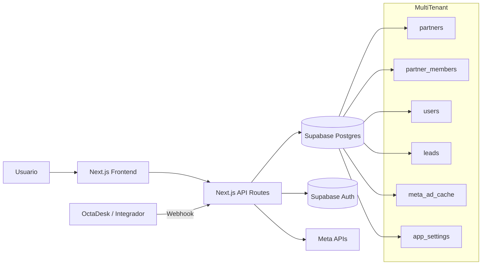

# Arquitetura Técnica – WhatsApp Tracking

Este documento descreve a arquitetura técnica atual do projeto, com foco em componentes, fluxo de dados, autenticação, multi-tenant e segurança.

---

## 1) Objetivo técnico

Capturar eventos do funil de vendas originados no WhatsApp (CTWA), enriquecer com dados de mídia da Meta e disponibilizar:

- visão analítica por campanha/ad set/anúncio;
- exportação de dados;
- isolamento por empresa (multi-tenant).

---

## 2) Stack e runtime

- **Frontend:** Next.js 15 (App Router), React 19, TypeScript, Tailwind CSS.
- **Backend:** API Routes do Next.js (`app/api/*`).
- **Banco e Auth:** Supabase Postgres + Supabase Auth.
- **Integrações:** Meta Marketing API e Meta Conversions API (Business Messaging).
- **Execução local:** porta `3000` (`pnpm dev`).

---

## 3) Componentes principais

### 3.1 Frontend (App Router)

- Páginas principais:
  - `/dashboard` (funil e série temporal)
  - `/configuracoes` e `/configuracoes/conversoes` (tokens e CAPI)
  - `/login`, `/auth/callback`, `/primeiro-acesso`
- Layout e UI:
  - componentes reutilizáveis em `components/ui`
  - layout de aplicação em `components/layout`

### 3.2 Backend (API Routes)

- **Autenticação/sessão**
  - `GET /api/auth/session`
  - `POST|DELETE /api/auth/cookie`
- **Leitura analítica**
  - `GET /api/funnel`
  - `GET /api/export`
- **Configurações por tenant**
  - `GET|POST /api/settings/meta-token`
  - `GET|POST /api/settings/meta-conversions`
  - `GET|POST /api/settings/webhook-secret`
- **Webhooks de funil**
  - `POST /api/webhooks/lead`
  - `POST /api/webhooks/sql`
  - `POST /api/webhooks/sale`
  - rotas legadas de compatibilidade (`/conversation-started`, `/opp`, `/ganho`)

### 3.3 Camada de domínio (`lib/*`)

- `server-auth.ts`: resolve usuário autenticado, partners acessíveis e autorização por `x-partner-id`.
- `webhook-auth.ts`: valida segredo por tenant e HMAC anti-replay (opcional).
- `meta-conversions.ts`: envio opcional de eventos à Meta CAPI.
- `get-meta-token.ts`: resolve token Meta por tenant (ou fallback de ambiente).
- `request-security.ts`: rate limit em memória e utilitários de IP.

### 3.4 Dados (Supabase)

- Tabelas de negócio e acesso:
  - `leads`, `meta_ad_cache`, `app_settings`
  - `partners`, `users`, `partner_members`
- RLS habilitada e reforçada (`force row level security`) nas tabelas sensíveis.

---

## 4) Fluxos de dados

## 4.1 Webhook `lead` (entrada CTWA)

1. Integrador envia POST com `x-partner-id` + segredo.
2. API valida parceiro, autenticação de webhook e rate limit.
3. Payload é parseado; campos CTWA são extraídos.
4. Busca de metadados de anúncio:
   - primeiro em `meta_ad_cache`;
   - fallback para Meta Marketing API.
5. Upsert em `leads` com status `lead`.
6. Opcional: envio de conversão para Meta CAPI (`lead`), se configurado.

## 4.2 Webhook `sql`

1. Recebe `conversation_id`.
2. Atualiza `leads.status = 'sql'` (escopado por `partner_id`).
3. Opcional: envia conversão `sql` para Meta CAPI.

## 4.3 Webhook `sale`

1. Recebe `conversation_id` ou `phone`.
2. Atualiza `status = 'venda'` e `won_at`.
3. Opcional: envia conversão `venda` para Meta CAPI.

## 4.4 Leitura de funil no dashboard

1. Front obtém sessão e partner ativo (`active_partner_id`).
2. Chama `GET /api/funnel` com `Authorization` + `x-partner-id`.
3. Backend filtra por tenant e período, agrega em memória e retorna série e ranking.

---

## 5) Multi-tenant e autorização

### 5.1 Modelo de tenant

- `partners` representa a empresa.
- `partner_members` define quem pertence a qual empresa.
- Tabelas de negócio usam `partner_id` obrigatório.

### 5.2 Regras de acesso

- Usuário autenticado via Supabase JWT.
- Endpoints internos exigem:
  - `Authorization: Bearer <access_token>`
  - `x-partner-id` válido para o usuário.
- Usuário global admin pode acessar todos os partners.

### 5.3 RLS

- Policies baseadas em:
  - `is_global_admin()`
  - `user_has_partner_access(partner_id)`
- `force row level security` protege isolamento mesmo se filtro de aplicação falhar.

---

## 6) Segurança

## 6.1 Controles implementados

- Cookie de sessão HTTP-only (`/api/auth/cookie`) para rotas de navegação.
- Verificação de domínio/e-mail permitido na autenticação.
- Segredo de webhook por tenant (`app_settings.key = webhook_secret`).
- Comparação de segredo em tempo constante.
- HMAC opcional com timestamp para proteção contra replay.
- Rate limiting básico por IP/usuário/rota.

## 6.2 Riscos conhecidos

- `app_settings.value` armazena segredos em texto no banco (token Meta, webhook secret).
- Rate limit é em memória de processo (não distribuído).
- Algumas agregações analíticas ocorrem no Node, não no SQL.

## 6.3 Melhorias recomendadas

- Criptografia de segredos em repouso (KMS/Secrets Manager).
- Rate limit distribuído (Redis/KV) para ambiente com múltiplas instâncias.
- Mover agregações pesadas para consultas SQL com `GROUP BY`.
- Observabilidade: métricas de webhook, fila e erros por partner.

---

## 7) Performance e escalabilidade

- **Atual:** bom para volume baixo/médio; cache de anúncios evita chamadas repetidas à Meta.
- **Gargalos potenciais:**
  - agregação em memória em `/api/funnel`;
  - rate-limit local por processo.
- **Evolução sugerida:**
  - pré-agregação diária por partner;
  - materialized views para dashboard;
  - fila assíncrona para envio CAPI em alta carga.

---

## 8) Diagrama (componentes e fronteiras)

---

## 9) Arquivos-chave

- `app/api/*` – endpoints de negócio.
- `lib/server-auth.ts` – autenticação e autorização tenant-aware.
- `lib/webhook-auth.ts` – autenticação de webhook e HMAC.
- `lib/meta-conversions.ts` – integração CAPI.
- `supabase/migrations/*` – evolução do schema e políticas RLS.

