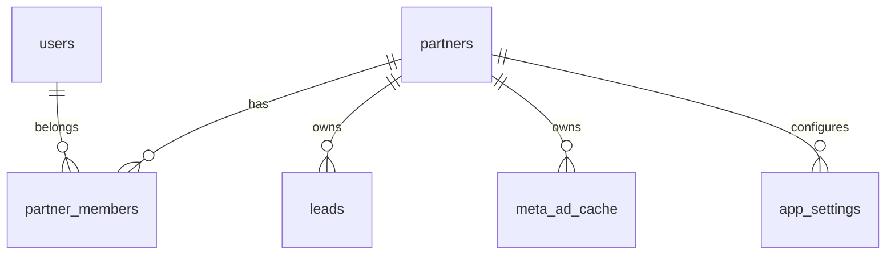

# Dicionário de Dados – WhatsApp Tracking

Este documento descreve as tabelas do banco, suas responsabilidades, principais colunas, relacionamentos e índices relevantes.

---

## 1) Visão geral do modelo

O modelo é multi-tenant com isolamento por empresa (`partner_id`) nas tabelas de negócio.

### Entidades centrais

- **Acesso e identidade:** `users`, `partners`, `partner_members`
- **Dados de funil:** `leads`
- **Cache de mídia:** `meta_ad_cache`
- **Configuração por tenant:** `app_settings`

---

## 2) Tabelas

## 2.1 `public.partners`

Representa empresas/tenants do sistema.

### Colunas principais

- `id` `uuid` PK
- `slug` `text` UNIQUE
- `name` `text` NOT NULL
- `logo_url` `text` NULL
- `auto_link_by_domain` `boolean` NOT NULL DEFAULT `false`
- `allowed_email_domain` `text` NULL
- `created_at` `timestamptz` NOT NULL DEFAULT `now()`
- `updated_at` `timestamptz` NOT NULL DEFAULT `now()`

### Regras

- Check de formato para `allowed_email_domain` (minúsculo, sem `@`, formato de domínio).
- Índice único parcial para domínio quando `auto_link_by_domain = true`.

### Uso na aplicação

- Base de segregação de dados.
- Seleção de empresa ativa no frontend.

---

## 2.2 `public.users`

Perfil de usuário da aplicação, vinculado ao Supabase Auth.

### Colunas principais

- `id` `uuid` PK, FK para `auth.users(id)` (`on delete cascade`)
- `email` `text` UNIQUE NOT NULL
- `full_name` `text` NULL
- `is_global_admin` `boolean` NOT NULL DEFAULT `false`
- `created_at`, `updated_at` `timestamptz`

### Uso na aplicação

- Controle de privilégio global.
- Sincronização via trigger ao criar usuário no Auth.

---

## 2.3 `public.partner_members`

Tabela de associação N:N entre usuários e empresas.

### Colunas principais

- `partner_id` `uuid` NOT NULL, FK `partners(id)` (`on delete cascade`)
- `user_id` `uuid` NOT NULL, FK `users(id)` (`on delete cascade`)
- `role` `text` NOT NULL DEFAULT `member`
- `created_at`, `updated_at` `timestamptz`

### Chave e regras

- PK composta: (`partner_id`, `user_id`)
- `role` com CHECK em: `owner`, `admin`, `member`
- Índices:
  - `idx_partner_members_user_id`
  - `idx_partner_members_partner_id`

### Uso na aplicação

- Define quais tenants o usuário pode acessar.

---

## 2.4 `public.leads`

Tabela fato do funil de conversão por conversa/lead.

### Colunas principais

- `id` `uuid` PK
- `partner_id` `uuid` NOT NULL, FK `partners(id)`
- `conversation_id` `text` NOT NULL
- `contact_name` `text` NULL
- `contact_phone` `text` NOT NULL
- `source_id` `text` NULL (AD_ID da Meta)
- `ctwa_clid` `text` NULL
- `headline`, `ad_body`, `image_url`, `source_url` `text` NULL
- `campaign_id`, `campaign_name` `text` NULL
- `adset_id`, `adset_name` `text` NULL
- `ad_name` `text` NULL
- `status` `text` NOT NULL DEFAULT `lead`
- `opp_id` `text` NULL
- `won_at` `timestamptz` NULL
- `created_at`, `updated_at` `timestamptz`

### Chaves/constraints

- CHECK `status IN ('lead', 'sql', 'venda')`
- Unicidade por tenant:
  - `uq_leads_partner_conversation` em (`partner_id`, `conversation_id`)

### Índices

- `idx_leads_conversation_id`
- `idx_leads_contact_phone`
- `idx_leads_status`
- `idx_leads_created_at`
- `idx_leads_campaign_id`
- `idx_leads_partner_created_at`
- `idx_leads_partner_status`
- `idx_leads_partner_contact_phone`

### Uso na aplicação

- Entrada pelos webhooks:
  - `lead` cria/upserta registro
  - `sql` atualiza status
  - `sale` marca venda e `won_at`
- Fonte de dados para dashboard e export.

---

## 2.5 `public.meta_ad_cache`

Cache por anúncio para reduzir chamadas à Meta Marketing API.

### Colunas principais

- `id` `uuid` PK
- `partner_id` `uuid` NOT NULL, FK `partners(id)`
- `ad_id` `text` NOT NULL
- `ad_name` `text` NULL
- `campaign_id`, `campaign_name` `text` NULL
- `adset_id`, `adset_name` `text` NULL
- `fetched_at` `timestamptz` NOT NULL DEFAULT `now()`

### Chaves/constraints

- Unicidade por tenant:
  - `uq_meta_cache_partner_ad_id` em (`partner_id`, `ad_id`)

### Índices

- `idx_meta_ad_cache_ad_id`
- `idx_meta_cache_partner_fetched_at`

### Uso na aplicação

- Enriquecimento de leads em webhook `lead`.

---

## 2.6 `public.app_settings`

Armazena configurações e segredos por tenant no formato chave/valor.

### Colunas principais

- `partner_id` `uuid` NOT NULL, FK `partners(id)`
- `key` `text` NOT NULL
- `value` `text` NOT NULL
- `updated_at` `timestamptz` NOT NULL DEFAULT `now()`

### Chaves/constraints

- Unicidade por tenant:
  - `uq_app_settings_partner_key` em (`partner_id`, `key`)

### Chaves utilizadas hoje (exemplos)

- `meta_access_token`
- `webhook_secret`
- `meta_capi_waba_id`
- `meta_capi_dataset_id`
- `meta_capi_partner_agent`
- `meta_capi_mapping`

### Uso na aplicação

- Configuração da integração Meta e segurança de webhook por empresa.

---

## 3) Relações (ER simplificado)

---

## 4) RLS e isolamento por tenant

- RLS habilitada em todas as tabelas de domínio.
- RLS forçada (`force row level security`) nas tabelas multi-tenant.
- Funções auxiliares:
  - `is_global_admin()`
  - `user_has_partner_access(p_partner_id uuid)`
- Policies de CRUD baseadas em vínculo de `partner_members` ou admin global.

---

## 5) Eventos de negócio e status

### Status de funil (`leads.status`)

- `lead`: conversa iniciada (entrada CTWA)
- `sql`: lead qualificado
- `venda`: venda fechada

### Campos de rastreio de mídia

- `source_id` (AD_ID), `ctwa_clid`, `campaign_*`, `adset_*`, `ad_name`.

---

## 6) Observações operacionais

- Segredos em `app_settings.value` estão em texto (avaliar criptografia em repouso).
- Para grande volume, considerar tabelas de agregação/materialized views para dashboard.
- Garantir que integrações externas enviem sempre `x-partner-id` correto.

