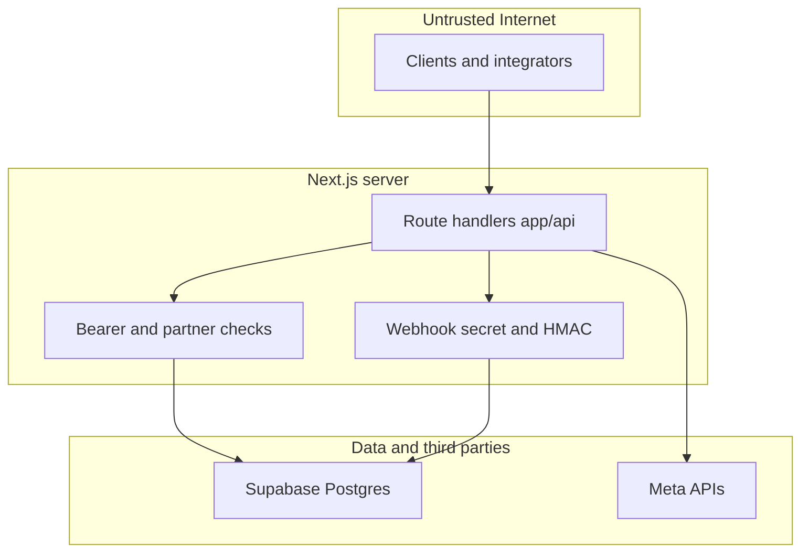

# Threat model — WhatsApp Tracking

Repo: Next.js 15 + Supabase (`whatsapp-tracking`). Evidências ancoradas em caminhos relativos ao root do projeto.

## Validação de contexto (assunções)

Execução em lote conforme plano de varredura; sem respostas novas do operador nesta rodada.

- **Uso pretendido:** painel interno para parceiros + ingestão de eventos OctaDesk/Meta (CTWA, funil).  
- **Deployment:** internet-facing (Vercel ou similar), HTTPS em produção.  
- **Dados:** PII de leads (nome, telefone, campanhas Meta).  
- **Multi-tenant:** `partner_id` em linhas de negócio; admin global por e-mail.  
- **Perguntas em aberto:** (1) webhooks saem de IPs fixos da OctaDesk? (2) `WEBHOOK_SECRET` é único global ou por tenant? (3) há WAF/rate limit na borda?

---

## Executive summary

Os maiores riscos são **abuso de webhooks** (quem possui o segredo pode direcionar escrita a qualquer `partner_id` conhecido), **bypass de RLS no servidor** pelo uso do **service role** do Supabase no backend Next, e **exfiltração de leads** via `/api/export` para usuários autenticados autorizados no partner (risco de conta comprometida ou token vazado). Controles parciais incluem segredo de webhook com comparação em tempo constante, HMAC opcional com janela de replay, e resolução de partner para usuários logados via `partner_members`.

---

## Scope and assumptions

**In scope:** `app/api/**`, `lib/**` usados por API, `supabase/migrations/**`, fluxos Meta (`lib/meta*.ts`).  
**Out of scope:** infraestrutura da OctaDesk/Meta, configuração exata do provedor de hospedagem, conteúdo de `.env.local`.  
**Assumptions:** atacante remoto pode chamar todas as rotas HTTP públicas; segredos em env não vazam exceto por outros bugs.

---

## System model

### Primary components

- **Browser:** dashboard React (App Router).  
- **Next.js Route Handlers:** `/api/*`.  
- **Supabase Postgres:** dados de `leads`, `app_settings`, `partners`, etc.  
- **Integrações externas:** API Graph do Meta (`fetchAdInfo`, conversões).

### Data flows and trust boundaries

- **Internet → Next API (Bearer):** JWT Supabase no header `Authorization`; validação em `getAuthenticatedUser` → `supabase.auth.getUser(token)` (`lib/server-auth.ts`). Dados: identidade, e-mail; garantia: token emitido pelo Supabase; partner via `x-partner-id` + checagem `partner_members`.  
- **Internet → Next API (Webhook):** header segredo + opcional HMAC + `x-partner-id`; corpo JSON OctaDesk. Garantia: segredo compartilhado; HMAC se `WEBHOOK_REQUIRE_HMAC=true`; **não** há vínculo criptográfico entre segredo e `partner_id` na implementação atual.  
- **Next → Supabase:** cliente JS com `SUPABASE_SERVICE_ROLE_KEY` quando definido (`lib/supabase.ts`) — **contorna RLS**; isolamento depende do código das rotas.  
- **Next → Meta:** token por partner em `app_settings`; chamadas server-side.

#### Diagram

---

## Assets and security objectives

| Asset | Why it matters | Objective |
|-------|----------------|-----------|
| Leads (PII, funil) | Privacidade, LGPD, integridade comercial | C + I |
| Meta access tokens | Acesso a anúncios e envio de conversões | C + I |
| `WEBHOOK_SECRET` | Impersonação de integração | C + I |
| Service role key | Leitura/escrita total no banco | C + I + A |
| Integridade de funil | Relatórios e otimização de mídia | I |

---

## Attacker model

### Capabilities

- Enviar HTTP(S) arbitrário para `/api/*`.  
- Obter ou adivinhar UUIDs de `partner_id` (enumerar se vazarem em URLs/logs).  
- Roubar tokens Bearer de sessão (XSS, malware, device).

### Non-capabilities

- Ler `process.env` sem RCE ou acesso ao host.  
- Quebrar TLS entre cliente e edge (fora de escopo).

---

## Entry points and attack surfaces

| Surface | How reached | Trust boundary | Notes | Evidence |
|---------|-------------|----------------|-------|----------|
| POST `/api/webhooks/lead` (+ aliases) | Internet | Webhook secret | CTWA ingest | `app/api/webhooks/lead/route.ts` |
| POST `/api/webhooks/sql`, `sale` | Internet | idem | Atualiza status | `app/api/webhooks/sql/route.ts`, `sale/route.ts` |
| GET `/api/export` | Internet | Bearer + partner | Exporta PII | `app/api/export/route.ts` |
| GET `/api/funnel` | Internet | Bearer + partner | Agregações | `app/api/funnel/route.ts` |
| GET/POST settings Meta | Internet | Bearer + partner | Tokens e config | `app/api/settings/meta-token/route.ts` |
| GET `/api/auth/session` | Internet | Bearer | Perfil e partners | `app/api/auth/session/route.ts` |

---

## Top abuse paths

1. **Objetivo:** poluir dados de um parceiro → obter `WEBHOOK_SECRET` → POST webhook com `x-partner-id` da vítima → upserts/updates em `leads`.  
2. **Objetivo:** exfiltrar leads → roubar JWT de usuário do domínio permitido → GET `/api/export` com `x-partner-id`.  
3. **Objetivo:** escalar para outro tenant como admin → comprometer conta `GLOBAL_ADMIN_EMAIL` ou bug em `isAllowedEmail` / `partner_members`.  
4. **Objetivo:** DoS de custo → chamadas repetidas a Meta `fetchAdInfo` via webhooks (depende de token e cache).  
5. **Objetivo:** replay de webhook → mitigado apenas se `WEBHOOK_REQUIRE_HMAC=true` e relógios alinhados.

---

## Threat model table

| Threat ID | Threat source | Prerequisites | Threat action | Impact | Impacted assets | Existing controls (evidence) | Gaps | Recommended mitigations | Detection ideas | Likelihood | Impact severity | Priority |
|-----------|---------------|---------------|---------------|--------|-----------------|------------------------------|------|-------------------------|-----------------|------------|-----------------|----------|
| TM-001 | Internet webhook caller | Segredo vazado ou adivinhado | POST com `x-partner-id` alheio | Integridade de funil; spam | Leads | Segredo + timing-safe compare; HMAC opcional (`lib/webhook-auth.ts`) | Um segredo global não prova intenção de tenant | Segredo por partner ou assinar partner no HMAC; rotação | Alerta em volume anômalo por partner | Medium | High | high |
| TM-002 | Autenticado malicioso | Token Bearer válido | Exportar todos os leads do partner | Exfiltração PII | Leads | `getAuthenticatedUser` + `resolvePartnerFromRequest` | Conta legítima comprometida = acesso total | MFA, expiração de sessão, auditoria de export | Log de export por usuário/IP | Low | High | medium |
| TM-003 | Qualquer um com service key | Vazamento de env / RCE | Acesso direto ao banco | Total | DB inteiro | Chave só no servidor | Superfície ampla se app tiver bug | Mínimo privilégio onde possível; secrets manager | Monitorar queries anômalas Supabase | Low | Critical | medium |
| TM-004 | Remoto anônimo | Dev `ALLOW_INSECURE_WEBHOOKS` | Webhooks sem segredo | Integridade | Leads | Só fora de produção (`webhook-auth.ts`) | Erro de config em staging | Garantir env em CI/CD | Teste de smoke em prod | Low | High | low |
| TM-005 | Remoto | Burst de requests | Saturar instância ou Meta | Disponibilidade | API, quota Meta | `isRateLimited` (`lib/request-security.ts`) | Por processo; não distribuído | Rate limit na edge / Redis | Métricas 429 e latência | Medium | Medium | medium |

---

## Criticality calibration (este repo)

- **Critical:** acesso total ao banco ou desvio massivo de leads entre tenants.  
- **High:** escrita arbitrária em `leads` de outro partner via webhook; vazamento de tokens Meta.  
- **Medium:** DoS ou abuso de quota; vazamento parcial via mensagens de erro.  
- **Low:** hardening de headers CSP onde XSS já é improvável.

---

## Focus paths for security review

| Path | Why | Threat IDs |
|------|-----|------------|
| `lib/webhook-auth.ts` | Segredo, HMAC, dev bypass | TM-001, TM-004 |
| `lib/server-auth.ts` | Bearer, partner, webhook partner resolve | TM-001, TM-002 |
| `lib/supabase.ts` | Service role fallback | TM-003 |
| `app/api/export/route.ts` | PII bulk | TM-002 |
| `app/api/webhooks/lead/route.ts` | Entrada rica + Meta | TM-001, TM-005 |
| `supabase/migrations/006_tenant_enforcement.sql` | Modelo tenant | TM-001–TM-003 |

---

## Quality check

- [x] Entry points da API inventariados  
- [x] Boundaries cobertos em threats  
- [x] CI/dev separado (`ALLOW_INSECURE_WEBHOOKS`, `NODE_ENV`)  
- [x] Assunções e perguntas explícitas  
- [x] Formato alinhado ao template do skill (seções principais)
